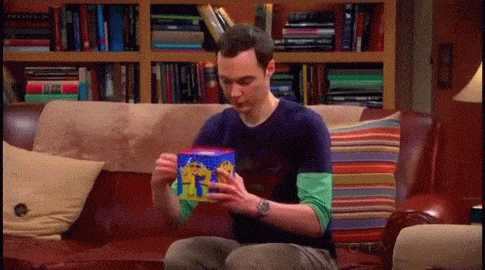

Link do figma: https://www.figma.com/design/BddUAVvEkmG1Dnw5xVdKiQ/SiteThebigbang?node-id=503-23&t=GwaIkxFTracJwEUi-1
# The Big Bang Landing Page



## Descrição

Esta é uma landing page inspirada na série *The Big Bang Theory*, criada para apresentar os principais elementos da série de forma atrativa e interativa.

## Figma

O design da landing page pode ser visualizado no Figma através do seguinte link: [Visualizar no Figma](https://www.figma.com/design/BddUAVvEkmG1Dnw5xVdKiQ/SiteThebigbang?node-id=503-23&t=GwaIkxFTracJwEUi-1)

## Tecnologias Usadas

- HTML
- CSS

## Como Executar o Projeto

1. Clone o repositório:
   ```bash
   git clone https://github.com/Kaylaineasb/the-big-bang-landing-page.git
